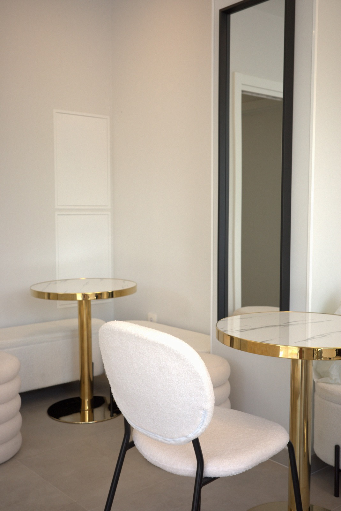

# SPEC v3 — Añadir dos secciones debajo del hero (medidas sobre las referencias)

Trabaja sobre `index.html` existente (el hero ya está aprobado, **no lo toques**). Añade debajo dos bloques, replicando las dos capturas que envió el cliente. Todo el texto en español, paleta blanco/negro de la marca (la referencia usa marrón tostado + amarillo pálido; nosotros los sustituimos por nuestros tokens).

## 0. La página ahora hace scroll

- `body { height: auto; overflow-x: clip; }` (hoy está fijo a `100svh` y sin scroll). El `.hero` **sigue midiendo `100svh`**.
- Fondo de página (la «plancha» que asoma entre tarjetas en la referencia, allí `#866F5D`): nuestro token `--cream-dark: #F1EFE9`. Añádelo a `:root` si no está.
- La señal `desliza` del hero pasa a ser un `<a href="#carta">` (ya tiene sentido).

## 1. Sección «dos tarjetas de texto» (`id="carta"`)

En la referencia: dos tarjetas a sangre, borde a borde, con esquinas muy redondeadas y una separación mínima entre ellas. Medidas: ancho de tarjeta = 100% del marco, radio = **3,5% del ancho del marco**, separación vertical entre tarjetas = **1,5% del ancho del marco**, padding interior ≈ **15% del ancho arriba y abajo** y ~6% a los lados. El texto ocupa 5 líneas con talla ≈ **6,6% del ancho del marco** y `line-height: 1.16`.

```html
<div class="cards" id="carta">
  <section class="card card--dark"><p>café cuando lo necesitas, comida cuando tienes hambre, algo dulce porque obviamente, y un sitio agradable donde estar mientras el día se aclara.</p></section>
  <section class="card card--light"><p>café de especialidad, molienda fresca, tueste cuidado, origen con criterio, quien es del café lo entiende. los demás se toman un café buenísimo.</p></section>
</div>
```

```css
.cards { display: grid; gap: calc(var(--u) * 1.5); }
.card {
  border-radius: calc(var(--u) * 3.5);
  padding: calc(var(--u) * 15) calc(var(--u) * 6);
}
.card p {
  font-family: var(--ui);            /* Archivo Narrow, igual que el lema del hero */
  font-size: calc(var(--u) * 6.6);
  line-height: 1.16;
  letter-spacing: 0.005em;
  text-align: left;
  text-wrap: pretty;
  margin: 0;
}
.card--dark  { background: var(--black);  color: var(--cream-dark); }  /* en la referencia el texto repite el color de la plancha */
.card--light { background: var(--cream);  color: var(--black); }
```

Todos los textos en minúscula, **verbatim** los de arriba.

## 2. Sección «tarjeta de foto con marquesina» (`id="galeria"`)

En la referencia: una tarjeta a sangre con esquinas redondeadas (mismo radio 3,5%), una foto dentro y, encima, una **palabra gigante clara, un poco rotada, recortada por los bordes de la tarjeta, que se desplaza en bucle**. Proporción de la tarjeta medida: ancho 1254 × alto 1342 → `aspect-ratio: 1254 / 1342`. La palabra ocupa ≈18% del ancho de marco de alto de letra y se ve algo más de una repetición.

```html
<section class="shot" id="galeria" aria-label="coco latte, el local">
  
  <div class="marquee" aria-hidden="true">
    <div class="marquee__row">
      <span class="marquee__copy">coco latte · coco latte · coco latte · coco latte · </span>
      <span class="marquee__copy" aria-hidden="true">coco latte · coco latte · coco latte · coco latte · </span>
    </div>
  </div>
</section>
```

```css
.shot { position: relative; aspect-ratio: 1254 / 1342; border-radius: calc(var(--u) * 3.5); overflow: clip; }
.shot img { position: absolute; inset: 0; width: 100%; height: 100%; object-fit: cover;
            object-position: center 42%; filter: brightness(.62) contrast(1.05); }
.marquee { position: absolute; left: 0; right: 0; top: 50%; transform: translateY(-50%) rotate(-4deg);
           overflow: clip; }
.marquee__row { display: flex; width: max-content; white-space: nowrap;
                animation: slide 48s linear infinite; }
.marquee__copy { font-family: "Bagel Fat One", cursive; color: var(--cream);
                 font-size: calc(var(--u) * 20); letter-spacing: -0.02em; }
@keyframes slide { from { transform: translateX(0); } to { transform: translateX(-50%); } }
```

- **Arco en la marquesina:** la referencia también arquea estas letras. Reutiliza tu función `arc()` sobre los glifos de cada `.marquee__copy` (normalizando `t` entre el primer y el último glifo de esa copia, como ya haces) con amplitud `frame.clientWidth * 0.048`, rotación `8deg * t`. Envuelve cada copia en un contenedor cuya anchura se pueda medir y vuelve a llamar a `arc()` tras `document.fonts.ready` y en `resize`. Si el arco complica el bucle, es aceptable dejarlo recto — pero **inténtalo primero**.
- `prefers-reduced-motion: reduce`: `animation: none` en `.marquee__row` (la palabra se queda quieta y legible) y sin arco animado.
- Comprueba que se ve aproximadamente **una repetición y un poco más**, como la referencia (si se ve mucho más corta, sube la talla; si se ven dos repeticiones enteras, baja la talla o acorta el texto).

## 3. Aparición al hacer scroll

Añade un `IntersectionObserver` que ponga `.is-in` una sola vez a `.card` y a `.shot` (opacidad 0→1, `translateY(18px)`→0, 700ms, `cubic-bezier(0.22,1,0.36,1)`, escalonado de 80ms entre las dos tarjetas). Con `prefers-reduced-motion: reduce` deben verse directamente, sin transformaciones. El hero no entra en esto.

## 4. Verificación (hazla tú, en el navegador, antes de terminar)

- A 390×844, 390×680, 834×1112 y 1280×900: `scrollWidth === clientWidth`, cero errores de consola.
- La página debe desplazarse; el hero sigue midiendo exactamente el alto del viewport.
- `desliza` lleva a `#carta`.
- Comprueba con `getBoundingClientRect` que las tarjetas van de borde a borde y que el `border-radius` es ≈3,5% del ancho.
- Contraste del texto: la tarjeta oscura con `--cream-dark` y la clara con `--black` deben quedar legibles.
- `node --check` al JS inline, sin `framer`/`Framer`, sin `git`.
