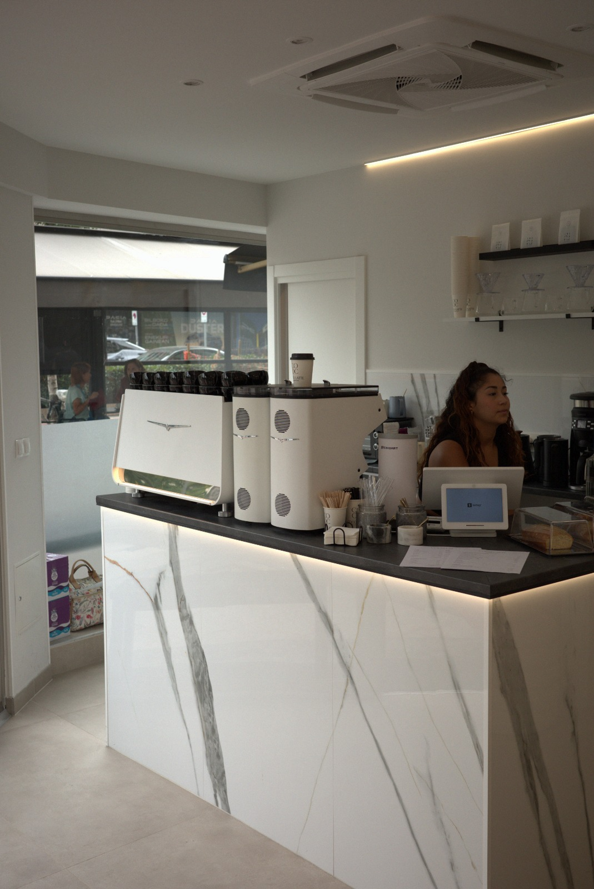
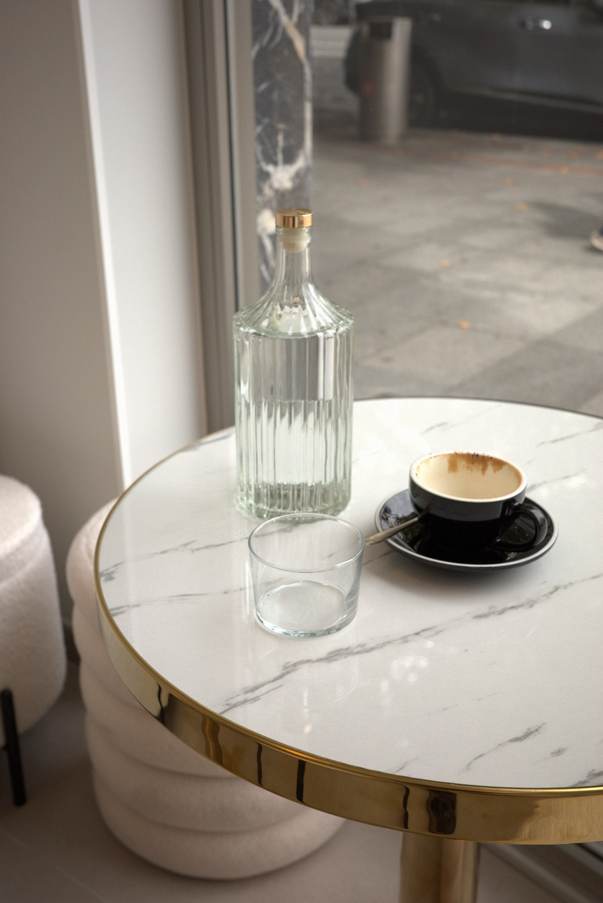

# SPEC v4 — Dos secciones nuevas: tarjeta de novedades + tarjeta promo con foto

Trabaja sobre `index.html`. No rehagas lo que ya está (hero + tarjetas de texto + tarjeta de foto con marquesina). Añade **dos secciones nuevas después** de la marquesina, en este orden: `#novedades` y `#promo`.

## 0. Tipografía: cambia la fuente de interfaz

La referencia usa **la misma familia condensada de altura de x muy grande** para el titular gigante, el párrafo, el botón, el lema del hero y el texto de las tarjetas. `Archivo Narrow` se queda corta (x-height pequeña). Cambia `--ui` a **`Oswald`** (Google Fonts, pesos 300/400/500) dejando `'Archivo Narrow'` como respaldo. Añade Oswald al `@import`/`link` de fuentes que ya exista. No cambies `--display` (`Bagel Fat One`), que sigue siendo la del logotipo gigante y la marquesina.

## 1. Un solo inset horizontal

Fija un token único y úsalo en todas las secciones nuevas y en las tarjetas de texto ya existentes: `--inset: 3.6` (en unidades `--u`, % del ancho del marco). Es decir, el padding lateral de `.card` y `.card-news` y el inset izquierdo del texto de `#promo` pasan a `calc(var(--u) * 3.6)` (venían de 5.5). Ajusta lo mínimo para que el texto no toque el borde.

## 2. Sección `#novedades` — tarjeta de titular gigante

Referencia medida: tarjeta a sangre, mismo radio 3.5%, fondo oscuro. Titular en dos líneas, minúsculas, justificado a la izquierda: línea 1 con un ancho de tinta del **88.8% del marco** y alto de tinta **25.3%**, línea 2 al **56%**, con `line-height` 1.28 (salto de línea fijo, no automático). Párrafo de **4 líneas**: alto de tinta **4.6%** del marco, interlineado 1.18, alineado a la izquierda, hasta el 90% del ancho. Botón: pastilla de esquinas redondeadas con relleno translúcido, texto claro y **un filete fino claro desplazado hacia abajo-derecha** (no concéntrico).

```html
<section class="card card--news" id="novedades">
  <h2 class="card-news__title">nuevo esta<br>semana</h2>
  <p class="card-news__text">cambian las cartas, llegan cosas nuevas, pasan planes, algunas cosas desaparecen rápido — aquí dejamos constancia de lo que está pasando ahora mismo en coco latte.</p>
  <a class="pill" href="#promo">explorar el tablón<span class="pill__arrow" aria-hidden="true">›</span></a>
</section>
```

```css
.card--news { background: var(--black); color: var(--cream); padding: calc(var(--u)*13) calc(var(--u)*3.6); }
.card-news__title {
  font-family: var(--ui); font-weight: 400;
  font-size: calc(var(--u) * 21); line-height: 1.28; letter-spacing: -0.01em;
  margin: 0 0 calc(var(--u)*6);
}
.card-news__text {
  font-family: var(--ui); font-weight: 300;
  font-size: calc(var(--u) * 4.9); line-height: 1.18; text-wrap: pretty;
  margin: 0 0 calc(var(--u)*9);
}
.pill {
  position: relative; display: inline-flex; align-items: center; gap: calc(var(--u)*2);
  font-family: var(--ui); font-weight: 400; font-size: calc(var(--u)*5);
  color: var(--cream); text-decoration: none; white-space: nowrap;
  padding: calc(var(--u)*2.4) calc(var(--u)*4.4);
  border-radius: calc(var(--u)*2.4);
  background: rgba(241, 239, 233, 0.22);      /* en la referencia es la plancha sólida; aquí translúcida para que el texto crema tenga contraste */
}
.pill::after {                                 /* filete desplazado, como la referencia */
  content: ""; position: absolute; inset: 0;
  transform: translate(calc(var(--u)*0.9), calc(var(--u)*0.9));
  border: 1.5px solid var(--cream); border-radius: inherit; pointer-events: none;
}
```

## 3. Sección `#promo` — dos fotos apiladas con palabra grande

Referencia medida: **dos tarjetas de foto a sangre**, cada una 1254×875 (proporción **1254/875**), radio 3.5%, separación **2.6%** del ancho. En la foto de abajo, tres textos: una palabra grande clara arriba (alto de letra ≈**8.5%** del ancho, una línea, con el 73% de ancho), y abajo a la izquierda dos líneas, la primera apagada y la segunda más fuerte y algo mayor.

```html
<div class="promo" id="promo">
  <figure class="promo__photo promo__photo--top">
    
  </figure>
  <figure class="promo__photo promo__photo--bottom">
    
    <figcaption class="promo__caption">
      <p class="promo__big">comparte si te portas bien</p>
      <p class="promo__line promo__line--soft">cafés fríos clásicos</p>
      <p class="promo__line promo__line--hard">2 por 10 €</p>
    </figcaption>
  </figure>
</div>
```

```css
.promo { display: grid; gap: calc(var(--u)*2.6); }
.promo__photo {
  position: relative; aspect-ratio: 1254 / 875; overflow: clip;
  border-radius: calc(var(--u)*3.5); background: var(--black); margin: 0;
}
.promo__photo img { position: absolute; inset: 0; width: 100%; height: 100%; object-fit: cover; }
.promo__photo--top img { object-position: center 42%; filter: brightness(.94); }
.promo__photo--bottom img { object-position: center 46%; filter: brightness(.72) contrast(1.04); }
.promo__photo--bottom::after { content:""; position:absolute; inset:0; z-index:1; background: rgba(19,18,16,.30); }
.promo__caption { position: absolute; z-index: 2; inset: 0; padding: calc(var(--u)*3.6); }
.promo__big {
  font-family: var(--ui); font-weight: 400; color: var(--cream);
  font-size: calc(var(--u)*8.5); line-height: 1; white-space: nowrap; margin: 0;
}
.promo__line { font-family: var(--ui); margin: 0; position: absolute; left: calc(var(--u)*3.6); }
.promo__line--soft { font-weight: 300; font-size: calc(var(--u)*4.6); color: rgba(251,250,247,.60);
                     bottom: calc(var(--u)*9.5); }
.promo__line--hard { font-weight: 500; font-size: calc(var(--u)*5.6); color: var(--cream);
                     bottom: calc(var(--u)*3.6); }
```

La palabra grande va **arriba** de la foto de abajo (con el `padding` del caption), no centrada. Si se desborda y queda recortada por la tarjeta, es correcto: en la referencia ocupa el 73% del ancho y no se recorta. Si se recorta, reduce su talla hasta que quepa con el inset.

## 4. Scroll, revelado y respeto por el movimiento

- Añade `#novedades` y las `.promo__photo` al `IntersectionObserver` que ya pone `.is-in` (mismo efecto, escalonado de 80ms). Con `prefers-reduced-motion: reduce` visibles directamente.
- `#promo` y `#novedades` deben quedar dentro del documento: sigue sin haber desbordamiento horizontal.

## 5. Verificación (hazla tú, en el navegador, antes de terminar)

- 390×844, 390×680, 834×1112 y 1280×900: `scrollWidth === clientWidth` y cero errores de consola.
- Mide y reporta: alto de tinta del titular, ancho de la línea 1 del titular (objetivo ≈89% del marco), tamaño del párrafo (4.9% del ancho → ~19px a 390), tamaño de la palabra grande (8.5% → ~33px a 390) y de `2 por 10 €`.
- Comprueba contraste real (luminancia) del texto del párrafo y del botón sobre la tarjeta negra, y de las dos líneas bajas sobre la foto: reporta los ratios.
- `node --check` al JS inline; sin `framer`/`Framer`; no uses git.
- Comprueba que la página sigue sin desbordarse y que el hero mide exactamente el viewport.
